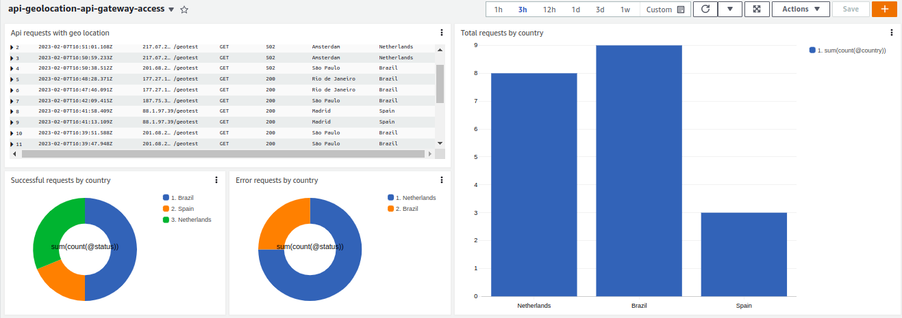
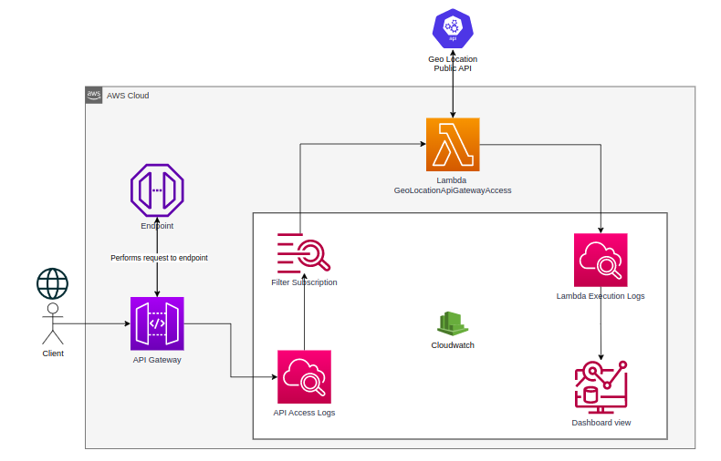

# API Gateway - Geo Location Dashboard

## Project Overview
The goal of this project is to allow AWS admins to  have an overview on the requests performed to API Gateway with a geographic perspective.

## Architecture
#### Design:

#### How it works:
In this project, we create an API Gateway service with "Access Logs" enabled.
This feature allows Api Gateway to automatically sends all requests data to a CloudWatch log group.
Containing request info about the request such as: HTTP Method, API resource (route), client's IP and much more.

On the CloudWatch LogGroup that receives all the ApiGateway requests info, there's a Lambda function listening to all new log events and reading them via _CloudWatch Subscription Filter_.

This Lambda function uses the client's IP to fetch geolocation data from a Public Service API and streams to another CloudWatch Log Group (attached to Lambda function execution).

Then, in the end, a CloudWatch query is filtering all the geolocation information generated in the Lambda and displaying to final user as a beaultiful Dashboard.

#### AWS Services used:
- [API Gateway] - API service.
- [Lambda] - FAAS (Function as a service).
- [Cloudwatch] - Queue processing.

## _Commands to deploy_

* `npm run package`                         compile typescript to js
* `cdk deploy --profile <aws_profile>`      deploy this stack to your default AWS account/region
* `cdk diff --profile <aws_profile>`        compare deployed stack with current state
* `cdk synth --profile <aws_profile>`       emits the synthesized CloudFormation template
